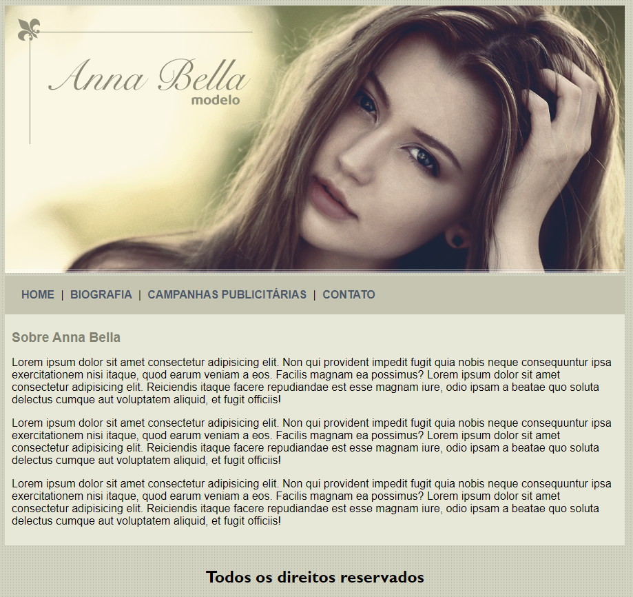

  

  <h2 align="center">Anna Bella</h2>

  

## Sobre o projeto
### Tela inicial

</img>

### Recursos

Esses foram os recursos usados para o desenvolvimento:

- **HTML5**
- **CSS3**

### Objetivo

Construir um blog com HTML e CSS3 para fins acadêmicos.

## License

This project is licensed under the MIT License - see the [LICENSE](https://opensource.org/licenses/MIT) page for details.
